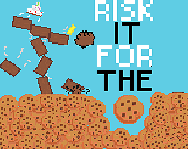

# **MATEUSZ KRETKOWSKI**

## CREATOR OF C_SDL3_GAME_ENGINE, Texture2DMapper, TextureMapAssistant

## Links to Projects

🔗 **[Brackeys Gamejam 2025.2 "Risk it for the Biscuit"](https://mm-cmp.itch.io/risk-it-for-the-biscuts)**

## MATEUSZ KRETKOWSKI'S TECHSTACK
- PYTHON
- C
- C++
- C#
- REACT
- NODEJS
- DJANGO
